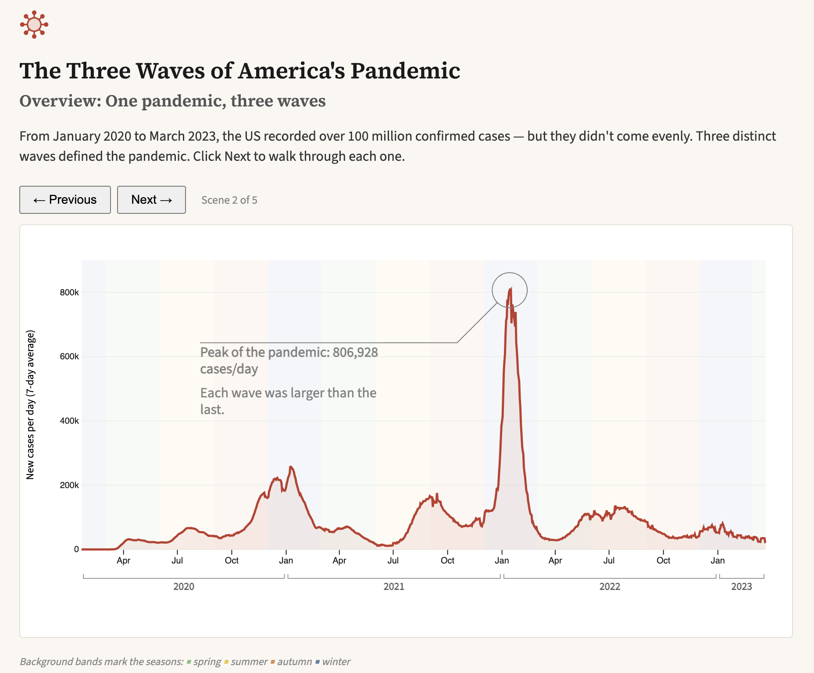

# Three Waves: A Narrative Visualization of COVID-19 in the US

An interactive slideshow built with D3.js that walks through the three
major waves of the US COVID-19 pandemic, using the NYT COVID dataset.

**[View the live visualization]([https://yourusername.github.io/your-repo/](https://sam-kazemi.github.io/Covid-Narrative/])**

## What it shows

Each scene highlights one wave on a 7-day-average line chart of new
cases, with annotations anchored to the computed peak of each wave.
A coordinated choropleth map shows per-capita cases by state for the
same time window, so you can see not just *when* each wave happened
but *where* it hit hardest.

## How it's built

- **D3.js v7** for the line chart, scales, and transitions
- **d3-annotation** for callouts positioned on computed peaks
- **topojson-client + us-atlas** for the state map
- Scene state is driven by a single `sceneIndex` parameter; each scene
  re-renders the highlighted window, annotation, and map coloring
- Tooltip uses `d3.bisector` to snap to the nearest date on hover

## Data

- [NYT COVID-19 data](https://github.com/nytimes/covid-19-data):
  `us.csv` (national) and `us-states.csv` (per-state)
- State populations for per-capita normalization

## Running locally

Clone the repo and serve it with any static server, e.g.:

    python -m http.server

Then open http://localhost:8000.

Built as the final project for CS416 Data Visualization (UIUC).
